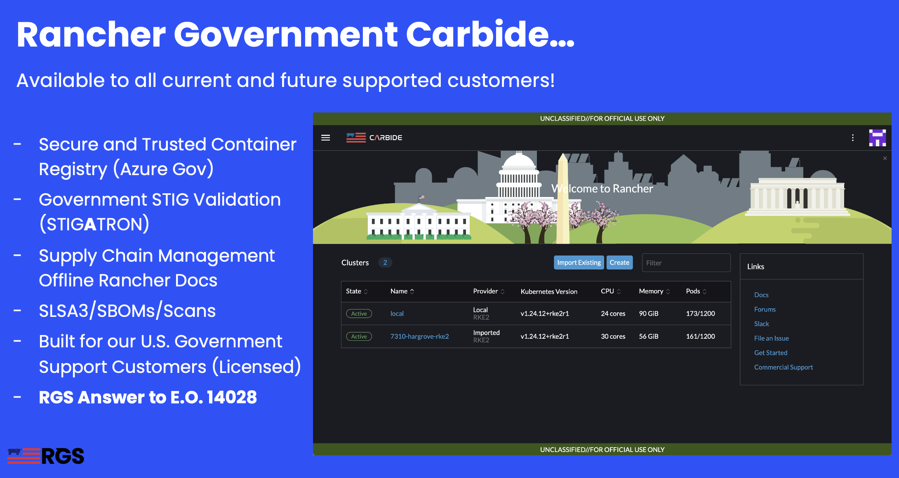

# RGS National Security Group Resources

### Table of Contents

* [Overview](#overview)
* [Introduction](#introduction)
* [Contact Information](#contact-information)
* [Publications and Articles](#publications-and-articles)
* [Videos and Tutorials](#videos-and-tutorials)
* [Guides and Repositories](#guides-and-repositories)
* [Rancher Documentation](#rancher-documentation)
* [Rancher Government Carbide](#rancher-government-carbide)
* [Rancher Architecture Diagram](#rancher-architecture-diagram)

## Overview
Welcome to the Rancher Government Solutions National Security Group Resources! Please use the repository to view all resources such a articles, blog posts, youtube videos, tutorials, etc... related to RGS's NatSec Group.

## Introduction
Rancher has a completely open-source software stack for teams adopting Kubernetes. It addresses the operational and security challenges of managing infrastructure and  Kubernetes clusters at scale, while providing DevSecOps teams with integrated tools for mission critical containerized workloads.

Rancher Government Solutions is specifically designed to address the unique security and operational needs of the United States Government, including civilians, military, and contractors, as it relates to application modernization, containers, and Kubernetes. We support all Rancher and SUSE products with United States based American citizens with the highest security clearances who are currently supporting programs across the Department of Defense, Intelligence Community, and civilian agencies.

RGS's NatSec Group specializes in supporting the Intelligence Community and is able to provide cleared onsite meetings, enterprise support, technical account managers, consulting engagements, and more. Please reach out to learn more!

## Contact Information
* **National Security Group (NatSec Group) - natsec@ranchergovernment.com**
* Rob Norton - Director of Special Programs
  * rob.norton@ranchergovernment.com
* Michael Sellers - Account Executive
  * michael.sellers@ranchergovernment.com
* Dale Novak - Account Executive
  * dale.novak@ranchergovernment.com
* Mike Rudd - Account Executive
  * michael.rudd@ranchergovernment.com  
* Zack Brady - Field Engineer
  * zack.brady@ranchergovernment.com
* Andy Clemenko - Field Engineer
  * andy.clemenko@ranchergovernment.com

### Publications and Articles
| Name | Location |
| ---- | -------- |
| Have you STIG'd RKE2 yet? | https://intelligencecommunitynews.com/ic-insiders-have-you-stigd-your-kubernetes-yet |
| Securing the Supply Chain with Carbide | https://intelligencecommunitynews.com/ic-insiders-can-i-get-chips-for-the-slsa-with-the-rancher-government-solutions-carbide |
| No Code Deployment of Rancher on AWS | https://intelligencecommunitynews.com/ic-insiders-no-code-deployment-of-rancher-kubernetes-on-aws-govcloud |
| Securing Kubernetes with the NSA Hardening Guide | https://intelligencecommunitynews.com/ic-insiders-creating-a-secure-kubernetes-deployment-five-ways-the-new-nsa-kubernetes-hardening-guide-can-help |
| Tactical Edge Reference Architecture | https://intelligencecommunitynews.com/ic-insiders-tactical-edge-reference-architecture |
| Driving Freedom of Choice with a Flexible Kubernetes Infrastructure | https://intelligencecommunitynews.com/ic-insiders-driving-freedom-of-choice-with-a-flexible-kubernetes-infrastructure |
| Effortless Deployment of the Rancher Stack | https://ranchergovernment.com/blog/effortless-deployment-of-rancher-rke2-rancher-manager-longhorn-and-neuvector |
| Airgapping the Rancher Stack in 20 Minutes | https://ranchergovernment.com/blog/how-to-air-gap-rke2-neuvector-longhorn-and-rancher |
| Encryption at Rest with Rancher Longhorn | https://ranchergovernment.com/blog/taking-advantage-of-encryption-at-rest-with-longhorn |
| No Code Deployment of Rancher on AWS | https://ranchergovernment.com/blog/aws-govcloud |
| Simple Install of the Rancher Stack | https://ranchergovernment.com/blog/article-simple-rke2-longhorn-and-rancher-install |
| NeuVector Classification Banner Guide | https://ranchergovernment.com/blog/new-neuvector-classification-support |
| Leveraging TLS Passthrough with Rancher RKE2 | https://ranchergovernment.com/blog/leveraging-rke2-with-tls-passthrough |
| Implementing GitOps with Rancher, ArgoCD, Vault on AWS | https://ranchergovernment.com/blog/implementing-gitops-on-kubernetes-using-aws-k3s-rancher-vault-and-argocd |

### Videos and Tutorials
| Name | Location |
| ---- | -------- |
| Interclypse Tech Talk (For Developers) | https://youtu.be/UHOohKp0aZw |
| Interclypse Tech Talk (For Infrastructure) | https://youtu.be/b-ZLC9khchg |
| Effortless Deployment of the Rancher Stack | https://youtu.be/P65r2ODNlTg |
| PlexiCluster - Rancher and Harvester at the Edge | https://youtu.be/NopZUT2eFbA |
| Airgapping the Rancher Stack in 20 Minutes | https://youtu.be/IkQJc5-_duo |
| Simple Install of the Rancher Stack | https://youtu.be/oM-6sd4KSmA |
| Can a 12 y/o install the Rancher Stack? | https://youtu.be/_70Z5-4lvEo |
| MaxPower - Rancher, Harvester, and GPUs at the Edge | https://youtu.be/Qdc_HKXacyM |
| Rancher on AWS Workshop | https://catalog.workshops.aws/rancher |
| RGS IC Workshop | https://github.com/clemenko/hobbyfarm/blob/main/ic-workshop.md |
| RKE2 and Multus Deployment | https://youtu.be/GHC4FwgTpe0 |
| Rancher Workshop | https://youtu.be/jU_w2GWQwxI |
| What is HobbyFarm | https://youtu.be/o5dJAjmou8s |
| What is Hauler | https://youtu.be/LC5925eovwE |
| NeuVector Federation | https://youtu.be/SthUj8TtesM |

### Guides and Repositories
| Name | Location |
| ---- | -------- |
| Rancher on AWS Workshop | https://catalog.workshops.aws/rancher |
| Rancher Government Hauler | https://github.com/rancherfederal/hauler |
| Rancher Cluster Templates | https://github.com/rancherfederal/rancher-cluster-templates |
| RGS IC Workshop | https://github.com/clemenko/hobbyfarm/blob/main/ic-workshop.md |
| AWS RKE2 Terraform | https://github.com/zackbradys/aws-rke2-terraform |
| Airgapping the Rancher Stack in 20 Minutes | https://github.com/clemenko/rke_airgap_install |
| Effortless Deployment of the Rancher Stack | https://github.com/zackbradys/rancher-effortless |
| Have you STIG'd RKE2 yet? | https://github.com/clemenko/rancher_stig |
| Encryption at Rest with Rancher Longhorn | https://github.com/clemenko/longhorn_encrypt |
| Simple Install of the Rancher Stack | https://github.com/clemenko/rke_install_blog |
| Driving Freedom of Choice with Rancher | https://github.com/clemenko/driving_freedom |
| Tactical Edge Reference Architecture | https://github.com/clemenko/tactical_edge |
| No Code Deployment of Rancher on AWS | https://github.com/zackbradys/rancher-on-aws |
| Securing Kubernetes with the NSA Hardening Guide | https://github.com/clemenko/nsa_rancher_guide |
| Rancher Stack Reference Architecture | https://github.com/clemenko/rancher-ref-arch |
| Rancher Fleet Push Button Demo | https://github.com/clemenko/catalog_demo |
| Rancher Fleet Customer Demo | https://github.com/zackbradys/rancher-customer-demos |
| RKE2 and Multus Deployment | https://gist.github.com/clemenko/18061e6b040cd2baffac11140c0c0680 |
| RKE2 and Kube Vip Deployment | https://gist.github.com/zackbradys/a7da049f11ca93e86e024952113281be |

### Rancher Documentation
| Name | Site | Docs |
| --- | --- | --- |
| Rancher Government | https://ranchergovernment.com |
| Rancher Government Carbide | https://ranchergovernment.com/carbide | https://ranchercarbide.dev |
| Rancher Harvester (HCI) | https://ranchergovernment.com/products/harvester | https://docs.harvesterhci.io |
| Rancher Kubernetes Engine 2 (RKE2) | https://ranchergovernment.com/products/rke2 | https://docs.rke2.io |
| Rancher Multi-Cluster Manager (MCM) | https://ranchergovernment.com/products/mcm | https://ranchermanager.docs.rancher.com |
| Rancher Longhorn (Storage) | https://ranchergovernment.com/products/longhorn | https://docs.longhorn.io |
| Rancher NeuVector (Security) | https://ranchergovernment.com/neuvector | https://open-docs.neuvector.com |
| Rancher Fleet (GitOps) | https://ranchermanager.docs.rancher.com/pages-for-subheaders/fleet-gitops-at-scale | https://fleet.rancher.io |
| Rancher Desktop (Local Development) | https://rancherdesktop.io | https://docs.rancherdesktop.io |
| Rancher Kubewarden (Policy Enforcement) | https://kubewarden.io | https://docs.kubewarden.io |
| Rancher Elemental (Baremetal Provisioning) |  | https://elemental.docs.rancher.com |

### Rancher Government Carbide

### Rancher Architecture Diagram

